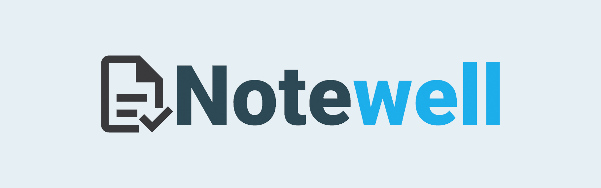

<!-- Notewell Logo -->
<br />
<div align="center">
  <a href="https://github.com/false-positive/notewell">
    
  </a>

  <h3 align="center">Take notes with ease</h3>

  <p align="center">
    <em>Notewell</em> is a set of tools that help you convert long, boring paragraphs to short and concise notes.
    <br />
    <a href="#installation"><strong>Run it locally »</strong></a>
    <br />
    <br />
    <a href="./LICENSE">License</a>
    ·
    <a href="https://github.com/false-positive/notewell/issues">Report Bug</a>
    ·
    <a href="https://github.com/false-positive/notewell/issues">Request Feature</a>
  </p>
</div>
<!-- TOOD: write this intro -->
<!-- ## About The Project -->

## Built With

-   [Django](https://djangoproject.com/)
-   [Svelte](https://svelte.dev)
-   [Vite](https://vite.dev)
-   [Svelte Material UI](https://sveltematerialui.com)

## Getting Started

### Prerequisites

-   [Python](https://python.org) 3.9 (or higher)
-   Pipenv

    ```shell
    $ python -m pip install -U pipenv
    ```

-   [Node](https://nodejs.org) v16.11.1 (or higher)
-   npm 8.1.3 (or higher)

    ```shell
    $ npm install -g npm@8.1.3
    ```

> The snippet assumes that you already have a version of npm installed

- [The moderation models](https://drive.google.com/drive/folders/1xSoSajUtSy8YyDWEXeiSh7CyaFLBcJaE?usp=sharing)

Download the content and place it in the `moderation_models` folder (not the individual model.tar.gz files).

### Installation

1. Clone the Notewell repo

In this documentation, we will clone the repo in the home directory of the user, however it is recommended that you put it in a better location. Just keep in mind that you will have to change it in the `cd` commands later on 🙂

```shell
$ git clone https://github.com/false-positive/notewell ~/notewell
```

2. Setup the Django development database

```shell
$ cd ~/website/
$ pipenv install && pipenv shell
$ python manage.py migrate
$ python manage.py loaddata fixtures/*.json
$ python manage.py changepassword admin
```

3. Run the Django development server

```shell
$ cd ~/website/
$ python manage.py runserver
```

This will start the Django development server on <http://localhost:8000>.

4. Run the Vite server (for the editor)

In order for the editor to work, you have to start the Vite server on port <http://localhost:3000>:

```shell
$ cd ~/editor/
$ npm install && npm run dev
```

> Note: Don't access <http://localhost:3000>. The Django server on :8000 automatically connects to it

5. Head on over to <http://localhost:8000/login/> and login as `admin` with the password you set earlier.

## License

This program is free software: you can redistribute it and/or modify
it under the terms of the GNU Affero General Public License as published by
the Free Software Foundation, either version 3 of the License, or
(at your option) any later version.

See [LICENSE](./LICENSE) for more details.
